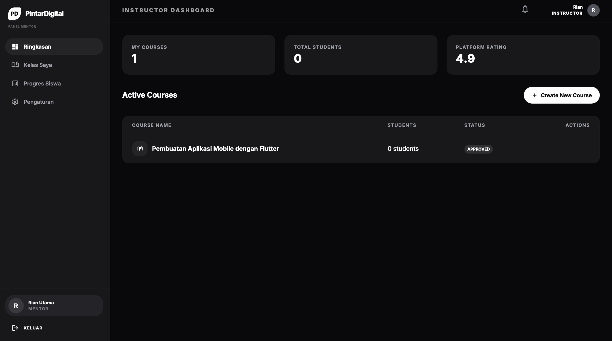
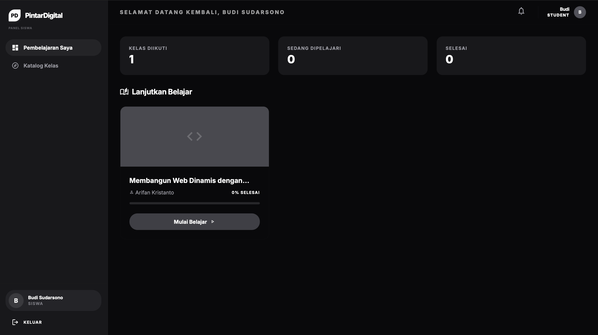
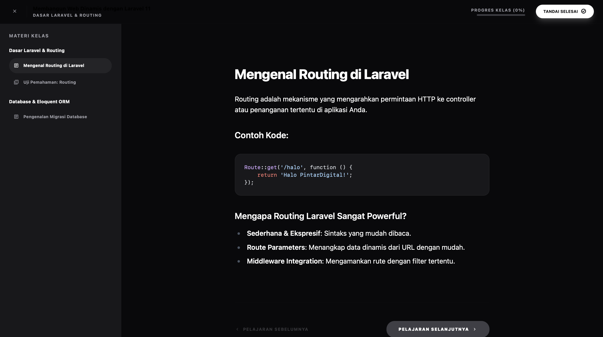

# 🎓 PintarDigital — Learning Management System (LMS) Modern

[](https://laravel.com)
[](https://www.php.net)
[](https://opensource.org/licenses/MIT)

PintarDigital adalah platform **Learning Management System (LMS)** profesional yang dirancang untuk memberikan pengalaman belajar-mengajar yang mulus, terstruktur, dan berkinerja tinggi. Aplikasi ini mengimplementasikan standar koding industri dengan pola desain yang bersih, estetika modern bertema gelap-terang minimalis (B&W), dan interaktivitas tingkat lanjut.

---

## 🎨 Pembaruan Desain & Estetika Premium (Terbaru)

PintarDigital kini hadir dengan desain antarmuka modern terinspirasi dari standar desain **Aceternity UI** dan **shadcn/ui**:
- **Black & White Minimalist Dark Theme**: Tema utama menggunakan warna hitam pekat (`#09090b`) sebagai dasar permukaan, dengan aksen kontras putih (`#ffffff`) dan abu-abu premium (`zinc/neutral`).
- **Global Grid Background Pattern**: Seluruh bagian landing page dan dashboard dibalut dengan background grid subtle bermotif geometris yang transparan dan menyatu lembut.
- **Glassmorphic Floating Navbar**: Navigasi atas melayang yang elegan dengan efek *blur* latar belakang (`backdrop-blur-md`) dan transisi navigasi interaktif.
- **Hero Floating Animation**: Ilustrasi kartu mockup interaktif pada Hero Section memiliki animasi mengambang lembut (`animate-float`) untuk meningkatkan kenyamanan visual.
- **Animated Testimonials (Blade Version)**: Komponen testimoni dinamis yang mensimulasikan pergeseran kartu 3D dengan rotasi, penskalaan acak, dan reveal kata per kata.
- **Collapsible Dashboard Sidebar**: Sidebar panel dashboard interaktif yang ringkas (`w-20`) dan melebar secara halus saat dihover (`hover:w-72`), lengkap dengan reveal teks dan pencantuman avatar instan.
- **Vibrant Code Syntax Highlighting**: Blok kode pemrograman di dalam materi pembelajaran tidak lagi hitam-putih; sekarang terintegrasi dengan **Highlight.js (GitHub Dark)** serta dilengkapi tombol salin kode cepat ("Salin / Tersalin!").

---

## 📸 Cuplikan Layar

<details>
<summary><b>Lihat Galeri Antarmuka</b></summary>

<p align="center">
  <strong>Halaman Utama (Landing Page)</strong><br>
  
</p>

<p align="center">
  <strong>Dashboard Instruktur</strong><br>
  
</p>

<p align="center">
  <strong>Dashboard Siswa</strong><br>
  
</p>

<p align="center">
  <strong>Detail Kursus & Halaman Belajar</strong><br>
  
</p>

</details>

---

## 🚀 Fitur Utama Berdasarkan Peran

PintarDigital menggunakan **Role-Based Access Control (RBAC)** yang kuat untuk membagi tanggung jawab pengguna:

### 🔐 Admin
*   **Manajemen User**: Mengelola seluruh pengguna (Admin, Instruktur, Siswa).
*   **Moderasi Kursus**: Meninjau, menyetujui, atau menolak permintaan publikasi kursus dari instruktur.
*   **Kategori & Pengaturan**: Mengatur kategori kursus global dan konfigurasi sistem.

### 👨‍🏫 Instruktur (Instructor)
*   **Course Creator**: Membuat kursus lengkap dengan deskripsi, thumbnail, dan kategori.
*   **Kurikulum Terstruktur**: Mengorganisir materi ke dalam *Chapters* dan *Sub-Chapters*.
*   **Quiz Engine**: Membuat kuis interaktif dengan pilihan ganda dan kunci jawaban.
*   **Insight**: Melihat status pendaftaran siswa pada kursus yang dikelola.

### 👨‍🎓 Siswa (Student)
*   **Discovery**: Mencari dan mendaftar pada berbagai kursus yang tersedia.
*   **Interactive Learning**: Akses materi terstruktur bebas gangguan dengan code syntax highlighting berwarna dan fungsionalitas salin cepat.
*   **Real-time Progress**: Pelacakan kemajuan belajar yang dihitung secara otomatis setiap kali bab diselesaikan.
*   **Quiz Attempt**: Mengambil kuis dan melihat hasil skor kelulusan secara instan (KKM kelulusan 70%).

---

## 🏗️ Arsitektur & Pola Desain

Aplikasi ini dibangun dengan fokus pada **Scalability** dan **Maintainability** menggunakan:

*   **Service Pattern**: Logika bisnis kompleks (seperti kalkulasi progress, validasi kuis, dan alur moderasi) diisolasi ke dalam `app/Services`.
*   **Repository Pattern**: Akses data dipisahkan melalui antarmuka Repositori di `app/Repositories`, memungkinkan fleksibilitas database di masa depan.
*   **Clean Routing**: Menggunakan *Route Groups* dan *Middleware* untuk keamanan akses berdasarkan peran.

### Struktur Folder Utama
```text
app/
├── Http/Controllers/    # Penanganan request yang ringkas (Thin Controllers)
├── Services/            # Logika Bisnis (misal: QuizService, CourseService)
├── Repositories/        # Abstraksi Database (Eloquent Implementation)
└── Models/              # Definisi Relasi Database
```

---

## 🛠️ Teknologi yang Digunakan

*   **Backend**: [Laravel 12](https://laravel.com) (PHP 8.2+)
*   **Database**: MySQL / MariaDB
*   **Frontend**: [Tailwind CSS](https://tailwindcss.com) (Material Design 3 & Black-White Custom Minimalist Aesthetics)
*   **Syntax Highlighting**: [Highlight.js](https://highlightjs.org/) (GitHub Dark Theme)
*   **Icons**: [Google Material Symbols](https://fonts.google.com/icons)
*   **Asset Bundling**: [Vite](https://vitejs.dev)

---

## ⚙️ Instalasi & Pengaturan

Pastikan Anda memiliki **PHP >= 8.2**, **Composer**, dan **Node.js** terinstal.

1.  **Clone Repositori**:
    ```bash
    git clone https://github.com/username/pintardigital.git
    cd pintardigital
    ```

2.  **Instal Dependensi**:
    ```bash
    composer install
    npm install
    ```

3.  **Konfigurasi Environment**:
    ```bash
    cp .env.example .env
    php artisan key:generate
    ```
    *Sesuaikan nilai `DB_DATABASE`, `DB_USERNAME`, dan `DB_PASSWORD` di file `.env`.*

4.  **Migrasi & Seed Database**:
    ```bash
    php artisan migrate:fresh --seed
    ```

5.  **Persiapan Folder Storage**:
    ```bash
    php artisan storage:link
    ```

6.  **Build Frontend & Run**:
    ```bash
    npm run build
    php artisan serve
    ```

---

## 🔐 Kredensial Pengujian

Gunakan akun berikut untuk menguji fitur setelah menjalankan `seed`:

| Peran | Email | Kata Sandi |
| :--- | :--- | :--- |
| **Admin** | `admin@pintardigital.com` | `password` |
| **Instruktur** | `instructor@pintardigital.com` | `password` |
| **Siswa** | `student@pintardigital.com` | `password` |

---

## 🤝 Berkontribusi

1. Fork repositori ini.
2. Buat branch fitur baru (`git checkout -b feature/FiturKeren`).
3. Commit perubahan Anda (`git commit -m 'Menambahkan Fitur Keren'`).
4. Push ke branch (`git push origin feature/FiturKeren`).
5. Buat Pull Request.

---

## 📄 Lisensi

Proyek ini dilisensikan di bawah **Lisensi MIT**. Lihat [LICENSE](LICENSE) untuk informasi lebih lanjut.
